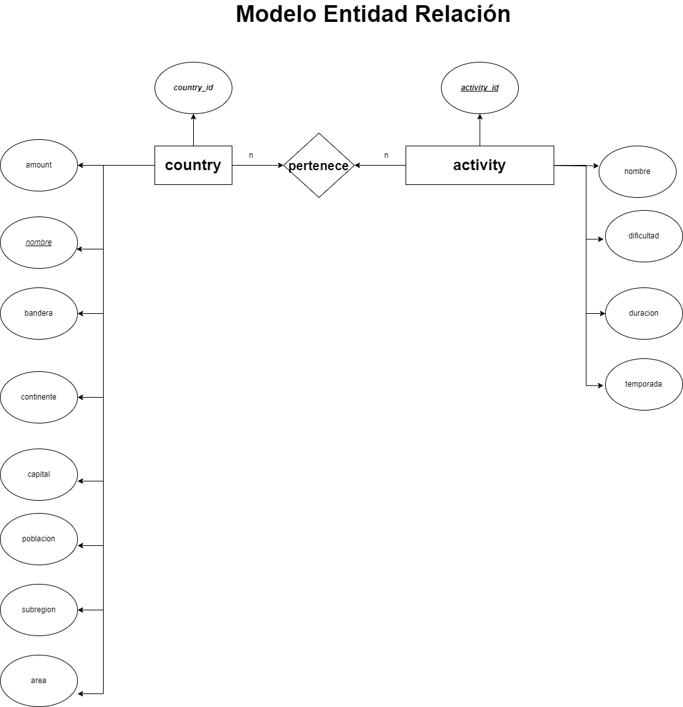
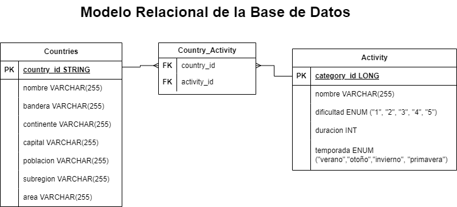

📌 El objetivo de este proyecto es construir una Single Page Application utlizando las tecnologías: **React**, **Redux**, **Node**, **Express** y **Sequelize**.
La idea de este proyecto es construir una aplicación web a partir de una API:
-  Buscar países.
-  Visualizar la información de los países.
-  Filtrarlos.
-  Ordenarlos.
-  Crear actividades turísticas.
--------------------------------------------------------------------------------------------------------------------------------------------------

### Listado de Entidades

**📍 MODELO 1 | Country**

-  ID (Código de tres letras). \*
-  Nombre. \*
-  Imagen de la bandera. \*
-  Continente. \*
-  Capital. \*
-  Subregión.
-  Área.
-  Población. \*

**📍 MODELO 2 | Activity**

-  ID. \*
-  Nombre. \*
-  Dificultad (número del 1 al 5). \*
-  Duración (en horas).
-  Temporada (Verano, Otoño, Invierno o Primavera). \*

### Relaciones
1. Varios **country** pueden _tener_ varias  **Activity** (n a n).

### Diagramas

### Modelo Entidad - Relacion

### Modelo Relacional de la BD

### ENDPOINTS

#### **📍 GET | /countries**

-  Obtiene un arreglo de objetos, donde cada objeto es un país con toda su información.

#### **📍 GET | /countries/:idPais**

-  Esta ruta obtiene el detalle de un país específico. Es decir que devuelve un objeto con la información pedida en el detalle de un país.
-  El país es recibido por parámetro (ID de tres letras del país).
-  Tiene que incluir los datos de las actividades turísticas asociadas a este país.

#### **📍 GET | /countries/name?="..."**

-  Esta ruta debe obtener todos aquellos países que coinciden con el nombre recibido por query. (No es necesario que sea una coincidencia exacta).
-  Debe poder buscarlo independientemente de mayúsculas o minúsculas.
-  Si no existe el país, debe mostrar un mensaje adecuado.

#### **📍 POST | /activities**

-  Esta ruta recibirá todos los datos necesarios para crear una actividad turística y relacionarla con los países solicitados.
-  Toda la información debe ser recibida por body.
-  Debe crear la actividad turística en la base de datos, y esta debe estar relacionada con los países indicados (al menos uno).

#### **📍 GET | /activities**

-  Obtiene un arreglo de objetos, donde cada objeto es una actividad turística.

 

